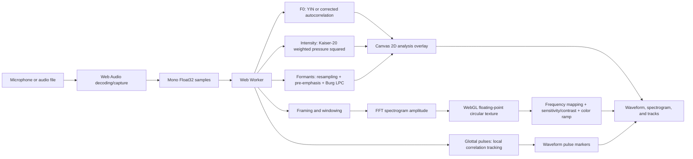

# Visualization and Acoustic Analysis Algorithms

**English** | [简体中文](algorithm.zh-CN.md)

Related: [Building Spectro](making-of.md) · [Building Spectro Pro](building-spectro-pro.en.md) · [README](../README.en.md)

This document makes the complete Spectro Pro path from input samples to screen pixels public. The formulas and parameters describe the current source code. If this document ever disagrees with the implementation, the code and tests take precedence. Links to the official Praat manual are included wherever the implementation draws on Praat definitions.

Spectro Pro is a browser-based visualization and teaching tool. It does not replace Praat or claim to provide research-grade measurements from calibrated hardware. Browser inputs normally contain normalized, unitless samples, so absolute dB SPL values have physical meaning only after the microphone has been calibrated against a sound-level meter.


_Sound begins at the vocal folds and is shaped by the pharyngeal, oral, and nasal cavities. Image by Tavin, from [Wikimedia Commons](https://commons.wikimedia.org/wiki/File:VocalTract_withNumbers.svg), licensed under [CC BY 3.0](https://creativecommons.org/licenses/by/3.0/)._

## 1. Overall data flow



The main source locations are:

| Stage | Source |
| --- | --- |
| Main loop, mode parameters, live batches, offline caches | [`src/index.ts`](../src/index.ts) |
| Framing, windows, FFT, and frequency sampling | [`src/spectrogram.ts`](../src/spectrogram.ts) |
| F0, intensity, resampling, pre-emphasis, Burg LPC, and root solving | [`src/analysis.ts`](../src/analysis.ts) |
| F0-guided glottal pulse locations | [`src/pulse-analysis.ts`](../src/pulse-analysis.ts) |
| Worker messages and analysis-layer scheduling | [`src/workers/helper.worker.ts`](../src/workers/helper.worker.ts) |
| WebGL textures, circular updates, and display parameters | [`src/spectrogram-render.ts`](../src/spectrogram-render.ts) |
| WebGL vertex and fragment shaders | [`src/shaders/vertex.glsl`](../src/shaders/vertex.glsl), [`src/shaders/fragment.glsl`](../src/shaders/fragment.glsl) |
| Waveform, multiresolution peak cache, and analysis overlay | [`src/waveform-render.ts`](../src/waveform-render.ts), [`src/index.ts`](../src/index.ts) |
| Synthetic signals, Praat references, and display-math tests | [`tests/synthetic-analysis.ts`](../tests/synthetic-analysis.ts) |

## 2. Input samples and time coordinates

### 2.1 Input

The microphone is opened through `getUserMedia`, with echo cancellation, noise suppression, and automatic gain control explicitly disabled. Local files are decoded with Web Audio. Multichannel input is averaged arithmetically into a mono `Float32Array`, after which both sources use the same analysis path. Audio never leaves the browser.

Microphone capture uses a `ScriptProcessorNode` with batches of 1,024 samples. Live analysis keeps roughly 180 ms in a rolling buffer and starts sending work to the Worker after at least about 85 ms has accumulated. This provides enough context for the spectrogram, F0, and centered formant windows.

### 2.2 Spectrogram modes

For an input sample rate `fs`, `modeConfiguration` in `src/index.ts` produces:

| Mode | Effective window | Default hop | Intended use |
| --- | --: | --: | --- |
| Broadband | 5 ms | 128 samples | Timing changes, syllable boundaries, formant movement |
| Narrowband | 30 ms | 256 samples | Harmonics and frequency structure |
| Custom | 15 ms by default | Based on window length | User-selected time/frequency tradeoff |

The sample window is `round(fs × duration)`, with a minimum of 32 samples. The FFT length is the smallest power of two that can contain the effective window; the extra positions are centered zero-padding. The default spectrogram height is 512 rows. The live circular history holds about eight seconds. Offline files increase the hop when necessary to keep the display near a maximum of 2,048 columns, without changing the window or per-frame FFT formula.

Each frame is timestamped at its center rather than its left edge. Live formant analysis requires real samples on both sides of that center, so the display retains about 25 ms of look-ahead by default. This does not change playback speed; it leaves room for the right half of the centered analysis window.

## 3. Spectrogram: from one frame to one column of color

### 3.1 Pre-emphasis and windows

The spectrogram display path uses the same form of 6 dB/octave pre-emphasis described by Praat:

```text
a = exp(-2π × 50 / fs)
y[0] = (1 - a) × x[0]
y[n] = x[n] - a × x[n - 1]       n > 0
```

The fixed 50 Hz starting frequency reduces the natural low-frequency slope of speech so that higher formants remain visible. It affects only the spectrogram. F0 and intensity use the input without pre-emphasis, while formants apply a separate whole-sound pre-emphasis pass.

The effective samples are then multiplied by a selected window. For length `N`, index `i=0...N-1`, and normalized centered position `u=(i-(N-1)/2)/((N-1)/2)`, the implementation offers:

```text
Rectangular: w(i) = 1
Hamming:     w(i) = 0.54 - 0.46 cos(2πi/(N-1))
Bartlett:    w(i) = max(0, 1 - |u|)
Welch:       w(i) = max(0, 1 - u²)
Hanning:     w(i) = 0.5 - 0.5 cos(2πi/(N-1))
Gaussian:    w(i) = exp(-0.5 × (u/0.4)²)
```

Positions outside the effective window and between that window and the FFT length are zero. Zero padding provides denser frequency samples but does not lengthen the real analysis interval.

For Gaussian windows, Praat gives approximately 260 Hz and 43 Hz of -3 dB bandwidth for 5 ms and 30 ms respectively. Those values motivate the broadband and narrowband presets. Bandwidth is not a way to obtain perfect resolution: shorter windows locate changes in time more accurately, while longer windows separate nearby frequency peaks more clearly.

### 3.2 FFT and frequency sampling

Let `W[n]=y[n]w[n]` and `X=FFT(W)`. A target frequency `f` is converted to a fractional FFT bin:

```text
k = f × Nfft / fs
j = floor(k)
r = k - j
A(f) = ((1-r)|X[j]| + r|X[j+1]|) / sqrt(Nfft)
```

`A(f)` is a display amplitude. It is not the `Pa²/Hz` power spectral density represented by a Praat `Spectrogram` object. The code does not normalize for window energy, microphone gain, or sound-card sensitivity, so the heat-map color cannot be read directly as dB SPL.

The frequency axis can be linear, log, Mel, Bark, or ERB. The core maps in [`src/math-util.ts`](../src/math-util.ts) are:

```text
Mel:  2595 log10(1 + f/700)
Log:  ln(1 + f/20)
Bark: 6 ln(f/600 + sqrt((f/600)² + 1))
ERB:  21.4 log10(1 + 0.00437f)
```

Changing the scale does not recompute the FFT. Spectral values first enter a regular floating-point grid. During rendering, screen rows are mapped back into that grid through the selected scale, with linear interpolation between adjacent bins.

## 4. F0: two estimates of periodicity

F0 is searched only within a configurable range, 75–500 Hz by default. Both algorithms begin with the same preparation:

1. Extract a physical window of about `3/f_min` seconds around the center, with at least 16 samples.
2. Set the target rate to `max(8000, 8×f_max)` and decimate by an integer stride.
3. Before decimation, apply a finite sinc low-pass anti-alias filter. Its half-width is `4×stride`, it has a cosine edge window, and its output is normalized by the sum of weights.
4. Remove the prepared signal's mean and calculate RMS; near-zero RMS is immediately unvoiced.

This is a real-time compromise that preserves the time structure needed for pitch while reducing the number of per-frame operations. It is not Praat's post-2023 Gaussian filtered-autocorrelation implementation; see Praat's [official filtered-AC description](https://praat.org/manual/pitch_analysis_by_filtered_autocorrelation.html).

### 4.1 Corrected autocorrelation

Let the prepared signal be `s[i]` with length `N`. It is first multiplied by a Hanning window:

```text
w[i] = 0.5 - 0.5 cos(2π(i+1)/(N+1))
v[i] = s[i] × w[i]
```

For candidate lag `τ`, the implementation calculates the windowed-signal correlation and the window's own correlation:

```text
Csignal(τ) = Σ v[i]v[i+τ]
Cwindow(τ) = Σ w[i]w[i+τ]
Psignal    = Σ v[i]²
Pwindow    = Σ w[i]²

R(τ) = Csignal(τ) / (Psignal × Cwindow(τ)/Pwindow)
```

`Cwindow(τ)` compensates for the systematic decay caused by fewer overlapping samples and the window edges at larger lags, following the same general edge-correction idea described by Praat. If a numerical result exceeds 1, the code uses its reciprocal.

The lag range is:

```text
floor(sampleRatePrepared / maxPitchHz) <= τ <= floor(sampleRatePrepared / minPitchHz)
```

Only local peaks with `R(τ)>0.3` are candidates. The selected candidate maximizes:

```text
score(τ) = R(τ) + 0.01 × log2(max(1, f(τ)/minPitchHz))
```

The second term is a small preference for higher candidates, reducing the chance that a lower subharmonic wins for a strongly periodic signal. A parabola through the peak and its two neighbors refines the lag, and `f=sampleRatePrepared/τ` produces F0. The correlation peak becomes `pitchConfidence`.

### 4.2 YIN

YIN first calculates the difference function:

```text
d(τ) = Σ (s[i] - s[i+τ])²
```

It then calculates the cumulative mean normalized difference (CMND):

```text
d'(0) = 1
d'(τ) = d(τ) × τ / Σ(j=1...τ) d(j)
```

Starting at the lag for `minPitch`, the code finds the first valley below `0.15` and follows it down to the local minimum. If no valley crosses the threshold, it uses the minimum over the search range. A value above `0.35` is unvoiced; otherwise `1-d'(τ)` becomes the confidence, and parabolic interpolation refines the valley.

Both algorithms pass through the same final voicing decision: F0 is displayed only when `pitchHz` is non-null and `pitchConfidence >= voicingThreshold`, with a default threshold of `0.6`. Finding a periodic candidate and deciding to mark the frame as voiced are therefore separate steps.

### 4.3 Relationship to Praat

The Praat manual treats raw autocorrelation, raw cross-correlation, filtered autocorrelation, and filtered cross-correlation as distinct methods for different tasks. Spectro Pro's corrected autocorrelation is a transparent, lightweight real-time implementation. It does not implement Praat's full candidate-path dynamic programming, octave-jump cost, voiced/unvoiced cost, or filtered AC, so frame-by-frame results should not be assumed identical.

## 5. Intensity and dB SPL

Praat defines sound-pressure intensity relative to threshold pressure `P0=2×10⁻⁵ Pa` as:

```text
I_dB = 10 log10( mean(p²) / P0² )
```

Spectro Pro adds local DC removal, Kaiser-20 weighting, and edge handling. For center sample `c` and pitch floor `Fmin`:

```text
halfWindow = 3.2 / Fmin
physicalWindow = 2 × halfWindow = 6.4 / Fmin
r_i = (i-c) / (fs × halfWindow)
k = 2π² + 0.5
w_i = I0(k × sqrt(max(0, 1-r_i²)))
p_i = x_i - mean(x in the local window)

P² = Σ(w_i p_i²) / Σw_i
I_dB = 10 log10(P² / (2×10⁻⁵)²) + calibrationDb
```

`I0` is the modified Bessel function of the first kind; the code approximates it with a series of at most 30 terms. Near the start or end of a sound, the window is clipped to available samples. Silence, or relative intensity below `10⁻³⁰`, returns `-300 dB`, following Praat's silence-floor semantics.

By default, a browser sample of `1.0` is interpreted as `1 Pa`, following the Praat Sound calculation convention. This is a convention rather than microphone calibration. `splCalibrationDb` can hold an externally measured offset.

The waveform's dBFS/dB SPL reference lines use a separate, simpler display path. Amplitude becomes dBFS through `20 log10(amplitude)`; dB SPL then adds `20 log10(1/(2×10⁻⁵))` and the calibration offset. That display conversion does not replace the local Kaiser-20 intensity analysis.

Session mean intensity is not a direct arithmetic mean in decibels. The code accumulates `10^(dB/10)` and finally calculates:

```text
meanDb = 10 log10( mean(10^(frameDb/10)) )
```

## 6. Formants: resampling, Burg LPC, and poles

The formant path follows the public algorithm description for Praat `Sound: To Formant (burg)...` as closely as practical. Defaults are:

```text
formant ceiling = 5500 Hz
maximum formants = 5
UI effective half-window = 25 ms
pre-emphasis from = 50 Hz
```

### 6.1 Common sample rate and anti-aliasing

The signal is first converted to:

```text
targetRate = min(inputRate, max(2000, 2 × formantCeiling))
```

With the default 5,500 Hz ceiling, a 48 kHz input becomes 11 kHz. When downsampling, the code pads the full sound with roughly 1,000 samples, performs an FFT, zeros bins beyond the target Nyquist frequency, and transforms back to obtain an anti-aliased signal. Depth-50 sinc interpolation then places each output sample on the input-sample time axis. The finite sinc kernel has a cosine window and uses the samples available near sound boundaries.

Resampling therefore happens once for the prepared sound rather than independently inside every short frame. Offline and rolling live analyses use the same implementation.

### 6.2 Whole-sound pre-emphasis and Gaussian window

After resampling, the complete signal is filtered as follows:

```text
a = exp(-2π × preEmphasisFrom / targetRate)
y[0] = x[0]
y[n] = x[n] - a × x[n-1]
```

The current code then extracts a physical `2×25 ms = 50 ms` frame around each center. The default formant-center step is `25 ms / 4 = 6.25 ms`. For a frame of length `N`:

```text
midpoint = (N+1)/2
edge = exp(-12)
g(i) = ( exp(-48(i-midpoint)²/(N+1)²) - edge ) / (1-edge)
```

The window multiplies the signal. The maximum `sample²` in the frame is retained as `formantIntensity`; this controls visual dynamic-range filtering and is not a dB SPL value.

### 6.3 Burg LPC

Five default formants correspond to ten poles because the prediction order is `2×maximumFormants`. The Burg process maintains forward error `F` and backward error `B`. At order `m`, the reflection coefficient is:

```text
k_m = 2 Σ F_i B_i / Σ(F_i² + B_i²)
```

Lower-order prediction coefficients are updated by:

```text
a_i(new) = a_i(old) - k_m × a_(m-i-1)(old)
```

The forward and backward errors become:

```text
F_i <- F_i - k_m B_i
B_i <- B_(i+1) - k_m F_(i+1)
```

The implementation is [`praatBurgCoefficients`](../src/analysis.ts). It checks every order for numerical failure and returns no result when the denominator is non-positive, a value is not finite, or the frame is too short.

### 6.4 From LPC poles to F1, F2, and beyond

The LPC coefficients form a polynomial. Initial roots come from the eigenvalues of its companion matrix, after which each root receives up to 12 complex Newton-polishing iterations. Only roots with a relative residual no greater than `1e-8` survive.

For root `z=r e^{jθ}`, frequency and bandwidth are:

```text
frequency = |θ| × targetRate / (2π)
bandwidth = -targetRate × ln(r) / π
```

Roots outside the unit circle are first mapped to their reciprocals inside it. The code keeps only roots with non-negative imaginary parts, then removes frequencies below 50 Hz, frequencies above `formantCeiling-50 Hz`, and negative bandwidths. Remaining candidates are sorted by frequency; the first five, or the configured count, are displayed as F1, F2, and so on, with bandwidth retained.

The Praat manual describes the same major Burg-formant stages: resampling to twice the ceiling, pre-emphasis, a Gaussian-like window, Burg LPC as described by Childers and Press, and twice as many poles as requested formants. Spectro Pro tests use deterministic frames generated by official Praat 6.6.30 at native 11 kHz and downsampled 48 kHz to catch regressions in frame centers, signs, windowing, root solving, and resampling.


_The visibly different F1 and F2 locations are why formants help distinguish vowels. Image by Ish ishwar, generated with Praat, from [Wikimedia Commons](https://commons.wikimedia.org/wiki/File:Spectrogram_-iua-.png), licensed under [CC BY 2.0](https://creativecommons.org/licenses/by/2.0/).\_

## 7. Glottal pulse markers

Pulse markers on the waveform do not come directly from FFT peaks. They use the calculated F0 as a period prior, following the same general idea as Praat `Sound & Pitch: To PointProcess (cc)`: locate high-amplitude periodic points inside voiced intervals.

1. Find continuous voiced frames. F0 confidence must be at least `0.3`, and gaps cannot exceed `max(60 ms, 3×frameStep)`.
2. Downsample by block averaging to approximately 12 kHz.
3. Near the middle of each voiced interval, choose the greatest absolute sample within half a predicted period on either side as a seed.
4. Track forward and backward. The next point must lie between 0.8 and 1.2 predicted periods away; candidates include local absolute peaks and the theoretical period position.
5. Remove the local mean from windows of about half a period around the reference and candidate, then calculate normalized correlation. Tracking stops below `0.3`; continuing outside the voiced interval requires at least `0.7`.
6. Refine the candidate with a parabola through neighboring correlation values and merge duplicate points that are too close.

These points are visual aids on the waveform. They do not replace complete pulse, jitter, shimmer, or pathological-voice analysis.

## 8. From values to pixels

### 8.1 WebGL spectrogram

Floating-point spectrogram amplitudes are stored in a single-channel GPU texture. On the CPU, a fixed-size `Circular2DBuffer` appends new columns and overwrites the oldest columns when full. The GPU receives only new regions through `texSubImage2D`. The fragment shader accepts the circular start, length, time offset, and zoom, then maps circular coordinates back into texture space with `mod(...,1.0)`.

Every display pixel applies:

```text
v = clamp(amplitude × sensitivity, 0, 1)
v' = log(1 + contrast × v) / log(1 + contrast)    (contrast > 0)
color = gradientTexture(v')
```

The color-ramp texture contains 128 samples. `src/color-util.ts` converts gradient stops from sRGB to Lab, applies quadratic ease-in/ease-out interpolation in Lab space, and converts back to RGB. Changing colors updates a one-dimensional texture without recalculating the FFT.

### 8.2 Canvas 2D overlays

The waveform and acoustic tracks use Canvas 2D:

-   The waveform builds a multiresolution cache beginning with 64-sample blocks. Each level stores minima, maxima, sums of squares, and sample counts, allowing zoomed views to choose an appropriate level instead of rescanning all raw samples.
-   Formants are colored dots positioned with the selected frequency scale; points below the visible dynamic range are hidden.
-   F0 normally uses its own linear 75–500 Hz range. Narrowband mode can align F0 with the spectrogram's frequency axis.
-   Intensity uses the current dB SPL display range, 50–100 dB SPL by default.
-   The cursor, selection, crosshairs, and playhead are interaction overlays and do not modify acoustic values.

## 9. Live scheduling and caches

The spectrogram, F0/intensity, and formants are independent analysis layers. Hiding a layer tells the Worker to skip its calculation. When parameters change, offline media caches recompute only the affected layers. Real-time precision changes calculation cadence, not the per-frame formulas:

| Precision | F0 frame stride | Formant frame stride | Additional behavior |
| --- | --: | --: | --- |
| Accurate | 1 | 1 | Calculate every batch |
| Balanced | 2 | 4 | Reuse the latest result at intervening centers |
| Smooth | 4 | 8 | Calculate F0 every second batch and formants every fourth batch |

`src/workers/helper.worker.ts` converts spectrogram-window centers into the common time centers used by all analysis layers. Offline files are analyzed and cached as a whole. Microphone input sends a rolling window and new-sample count to the Worker while the main thread updates queues, overlays, and the UI. The GPU does not redraw a static view; performance settings can also lower the frame rate or internal pixel resolution and disable the glass effect.

## 10. Validation, reproducibility, and limits

Run:

```bash
npm test
```

Current tests cover:

-   YIN and corrected autocorrelation for 80, 120, 200, and 440 Hz sine waves;
-   missing fundamentals, high-frequency interference, deterministic noise, and unvoiced decisions;
-   a 0 dB SPL reference tone, mean removal, Kaiser intensity, and the `-300 dB` silence floor;
-   pulse periods derived from acoustic F0 tracking;
-   Burg formants for 11 kHz and 48 kHz input against official Praat 6.6.30 reference frames;
-   display pre-emphasis, every spectrogram window, frequency-scale round trips, waveform dBFS/dB SPL math, and localization.

Important differences and limits are:

1. **The heat map is not calibrated PSD.** Its values pass through windowing, FFT normalization, sensitivity, contrast, and color mapping for display.
2. **F0 is not a complete Praat Pitch object.** Spectro Pro returns one candidate and confidence value rather than optimizing a path through multiple candidates.
3. **Live mode favors low latency.** Rolling buffers, result reuse, and precision profiles affect update density over time; offline analysis is more complete.
4. **dB SPL depends on calibration.** The default `1.0 sample = 1 Pa` convention aligns the calculation with Praat, but browser devices do not guarantee that physical mapping.
5. **Edge frames contain less context.** Local windows are clipped or zero-padded near the start and end, so F0, intensity, and formants can be less stable there.
6. **Formants are model estimates.** LPC poles can create spurious formants. Filtering below 50 Hz and above `ceiling-50 Hz` removes obvious edge artifacts but cannot guarantee that every track is a real vocal-tract resonance.

For publications, clinical work, forensics, or other precision measurements, use calibrated equipment and reanalyze the original audio in Praat or another professional tool. The purpose of this transparency is to explain what Spectro Pro does and does not do, rather than presenting a visualization as a measurement beyond the implementation's capabilities.

## 11. Praat references and acknowledgment

The project draws on explanations in the official Praat manual:

-   [Sound: To Spectrogram...](https://praat.org/manual/Sound__To_Spectrogram___.html): short-term analysis, window duration, bandwidth, and window shape;
-   [Spectrogram](https://praat.org/manual/Spectrogram.html): the time-frequency grid;
-   [Sound: To Spectrum...](https://praat.org/manual/Sound__To_Spectrum___.html): FFT, zero-padding, and real-signal frequency symmetry;
-   [Sound: To Pitch (raw autocorrelation)...](https://praat.org/manual/Sound__To_Pitch__raw_autocorrelation____.html) and [autocorrelation](https://praat.org/manual/Sound__Autocorrelate___.html): raw AC and edge correction;
-   [Pitch analysis by filtered autocorrelation](https://praat.org/manual/pitch_analysis_by_filtered_autocorrelation.html): the purpose of filtered AC and its differences from raw AC;
-   [Sound: To Formant (burg)...](https://praat.org/manual/Sound__To_Formant__burg____.html): resampling, pre-emphasis, Gaussian-like windows, Burg LPC, and poles;
-   [Sound: To Intensity...](https://praat.org/manual/Sound__To_Intensity___.html) and [Sound: Get intensity (dB)](https://praat.org/manual/Sound__Get_intensity__dB_.html): the Kaiser-20 window and dB SPL definition;
-   [PointProcess](https://praat.org/manual/PointProcess.html) and [Sound: To PointProcess (periodic, cc)...](https://praat.org/manual/Sound__To_PointProcess__periodic__cc____.html): periodic pulse locations in voiced intervals;
-   [Sound: Pre-emphasize (in-place)...](https://praat.org/manual/Sound__Pre-emphasize__in-place____.html): the pre-emphasis coefficient and recurrence.

Special thanks to the [Praat project](https://www.fon.hum.uva.nl/praat/), Paul Boersma, David Weenink, and its contributors for documenting speech-analysis definitions and algorithms so clearly. Spectro Pro uses those public documents to build an explainable browser analysis layer, but it is an independent project. Using Praat reference values in tests does not imply endorsement by the Praat project.
