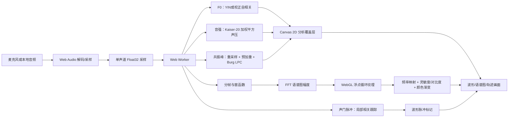

# 可视化与声学分析算法

[返回中文 README](../README.md) | [English README](../README.en.md) | [开发历程](building-spectro-pro.zh-CN.md)

本文把 Spectro Pro 从输入采样到屏幕像素的整条链路公开出来。公式和参数以当前
源码为准；如果本文与代码不一致，应以代码和测试为准。文中涉及 Praat 的定义时，
均链接到 Praat 官方手册，方便读者继续阅读。

Spectro Pro 是浏览器中的视觉与教学工具，不是 Praat 的替代品，也不宣称提供经过
硬件校准的研究级测量。尤其是浏览器输入通常是无量纲的归一化采样，绝对 dB SPL
必须经过麦克风和声级计校准后才有物理意义。


*声音从声带产生，经咽腔、口腔和鼻腔共同塑形。图：Tavin，来源 [Wikimedia Commons](https://commons.wikimedia.org/wiki/File:VocalTract_withNumbers.svg)，[CC BY 3.0](https://creativecommons.org/licenses/by/3.0/)。*

## 1. 总体数据流



主要源码入口如下：

| 环节 | 源码 |
| --- | --- |
| 主循环、模式参数、实时批处理、离线缓存 | [`src/index.ts`](../src/index.ts) |
| 分帧、窗函数、FFT 与频率采样 | [`src/spectrogram.ts`](../src/spectrogram.ts) |
| F0、音强、重采样、预加重、Burg LPC、根求解 | [`src/analysis.ts`](../src/analysis.ts) |
| 基于 F0 的声门脉冲定位 | [`src/pulse-analysis.ts`](../src/pulse-analysis.ts) |
| Worker 消息与分析层调度 | [`src/workers/helper.worker.ts`](../src/workers/helper.worker.ts) |
| WebGL 纹理、循环更新和显示参数 | [`src/spectrogram-render.ts`](../src/spectrogram-render.ts) |
| WebGL 顶点/片段着色器 | [`src/shaders/vertex.glsl`](../src/shaders/vertex.glsl)、[`src/shaders/fragment.glsl`](../src/shaders/fragment.glsl) |
| 波形、多分辨率峰值缓存和分析覆盖层 | [`src/waveform-render.ts`](../src/waveform-render.ts)、[`src/index.ts`](../src/index.ts) |
| 合成信号、Praat 参考值和显示数学测试 | [`tests/synthetic-analysis.ts`](../tests/synthetic-analysis.ts) |

## 2. 输入采样与时间坐标

### 2.1 输入

麦克风通过 `getUserMedia` 获取，并显式关闭回声消除、降噪和自动增益；本地文件由
Web Audio 解码。多声道输入按声道算术平均为单声道 `Float32Array`，然后进入相同的
分析流程。音频数据不会上传服务器。

麦克风使用 1024 个采样一批的 `ScriptProcessorNode`。实时分析保留约 180 ms 的
滚动缓冲，至少积累约 85 ms 后才开始送入 Worker。这样可以同时容纳语谱图窗口、F0
窗口和居中的共振峰窗口。

### 2.2 语谱图模式

对采样率为 `fs` 的输入，模式参数由 `src/index.ts` 的 `modeConfiguration` 生成：

| 模式 | 有效分析窗 | 默认步长 | 用途 |
| --- | ---: | ---: | --- |
| 宽带 | 5 ms | 128 samples | 时间变化、音节边界、共振峰运动 |
| 窄带 | 30 ms | 256 samples | 谐波、频率结构 |
| 自定义 | 15 ms | 由窗长决定 | 在时间和频率分辨率之间自行取舍 |

实际采样窗长度是 `round(fs × 窗长)`，但至少为 32 个采样。FFT 长度取不小于有效
窗长度的最小二次幂；多出来的部分是居中的零填充。默认语谱图高度为 512 行。实时
循环历史约保留 8 秒；离线文件为了避免画面过宽，会把列数控制在最多 2048 列左右，
相应增加离线步长，但不会改变每一帧的窗函数和 FFT 公式。

每一帧的时间坐标是窗口中心，而不是窗口左边界。实时共振峰分析需要中心两侧都有样本，
因此会让画面相对输入保留默认约 25 ms 的 look-ahead；这不是改变音频播放速度，而是
给居中分析窗留出右侧真实采样。

## 3. 语谱图：从一帧到一列颜色

### 3.1 预加重与窗函数

语谱图显示链路使用 Praat 手册中相同形式的 6 dB/octave 预加重系数：

```text
a = exp(-2π × 50 / fs)
y[0] = (1 - a) × x[0]
y[n] = x[n] - a × x[n - 1]       n > 0
```

这里的 50 Hz 是显示语谱图的固定预加重起点，用来减弱语音自然的低频谱倾斜，让较高
频率的共振峰更容易被看见。它只作用于语谱图这一层；F0 和音强使用未预加重的输入，
共振峰则有自己对整段声音进行的预加重步骤。

然后对有效窗中的采样乘以一个窗函数。对长度为 `N`、索引 `i=0...N-1` 的窗，当前
实现提供：

```text
Rectangular:  w(i) = 1
Hamming:     w(i) = 0.54 - 0.46 cos(2πi/(N-1))
Bartlett:    w(i) = max(0, 1 - |u|)
Welch:       w(i) = max(0, 1 - u²)
Hanning:     w(i) = 0.5 - 0.5 cos(2πi/(N-1))
Gaussian:    w(i) = exp(-0.5 × (u/0.4)²)
```

其中 `u=(i-(N-1)/2)/((N-1)/2)`。窗外和有效窗到 FFT 长度之间的位置填零，因此零填充
提高频率采样密度，但不会把真实的分析时间窗变长。

Praat 对 5 ms Gaussian 窗和 30 ms Gaussian 窗分别给出约 260 Hz 与 43 Hz 的 -3 dB
带宽；这也是宽带/窄带两个预设的来源。带宽不是“真实频率分辨率”的神奇开关：窗越短，
时间定位越好；窗越长，频率峰越容易分开。这就是短时傅里叶分析的时间—频率折衷。

### 3.2 FFT 与频率取样

令 `W[n]=y[n]w[n]`，`X=FFT(W)`。对目标频率 `f`，代码将它换算为 FFT 的浮点 bin：

```text
k = f × Nfft / fs
j = floor(k)
r = k - j
A(f) = ((1-r)|X[j]| + r|X[j+1]|) / sqrt(Nfft)
```

这里的 `A(f)` 是用于显示的幅度值，不是 Praat `Spectrogram` 对象所定义的
`Pa²/Hz` 功率谱密度。代码也没有对窗能量、麦克风增益和声卡灵敏度做统一物理校准，
因此热力图颜色不能直接解释为 dB SPL。

频率轴可以是线性、log、Mel、Bark 或 ERB。其核心映射在
[`src/math-util.ts`](../src/math-util.ts) 中：

```text
Mel:  2595 log10(1 + f/700)
Log:  ln(1 + f/20)
Bark: 6 ln(f/600 + sqrt((f/600)² + 1))
ERB:  21.4 log10(1 + 0.00437f)
```

频率轴不是通过重新计算 FFT 得到的。FFT 结果先保存在规则的浮点网格中，显示时再按
所选刻度把屏幕行映射回这个网格，并对相邻 bin 做线性插值。

## 4. F0：周期性的两种估计

F0 只在可配置范围内搜索，默认范围为 75–500 Hz。两种算法都先做同样的准备：

1. 取中心附近约 `3/f_min` 秒的物理窗口，至少 16 个采样。
2. 目标采样率取 `max(8000, 8×f_max)`，按照整数步长降采样。
3. 降采样前用有限长度的 sinc 低通核抗混叠。核的半宽为 `4×stride`，外面乘一个余弦边缘窗，最后按权重和归一化。
4. 对准备好的信号减去平均值，并计算 RMS；RMS 极小时直接返回无声。

这一步是 Spectro Pro 的实时折衷：它保留音高搜索所需的时间结构，同时减少每帧的乘加
量。它不是 Praat 2023 年之后的 Gaussian filtered autocorrelation 实现；Praat 的
过滤自相关算法与原理见[官方说明](https://praat.org/manual/pitch_analysis_by_filtered_autocorrelation.html)。

### 4.1 校正自相关

准备好的信号记为 `s[i]`，长度为 `N`。代码先乘 Hanning 窗：

```text
w[i] = 0.5 - 0.5 cos(2π(i+1)/(N+1))
v[i] = s[i] × w[i]
```

对候选延迟 `τ`，计算加窗信号的相关和窗函数自身的相关：

```text
Csignal(τ) = Σ v[i]v[i+τ]
Cwindow(τ) = Σ w[i]w[i+τ]
Psignal    = Σ v[i]²
Pwindow    = Σ w[i]²

R(τ) = Csignal(τ) / (Psignal × Cwindow(τ)/Pwindow)
```

`Cwindow(τ)` 用来补偿由于延迟后可重叠样本变少、窗边缘衰减造成的系统性下降；这对应
Praat 对自相关边缘效应的校正思路。若数值结果大于 1，代码取其倒数以避免异常值。

候选延迟范围是：

```text
floor(sampleRatePrepared / maxPitchHz) <= τ <= floor(sampleRatePrepared / minPitchHz)
```

代码只接受 `R(τ)>0.3` 的局部峰，并在多个候选中最大化：

```text
score(τ) = R(τ) + 0.01 × log2(max(1, f(τ)/minPitchHz))
```

第二项是很小的高频偏好，用来减少纯周期信号中低频子谐波抢占候选的机会。选中峰后，
用峰左右三个点做抛物线插值，再由 `f=sampleRatePrepared/τ` 得到 F0。相关峰值被作为
`pitchConfidence`。

### 4.2 YIN

YIN 先计算差分函数：

```text
d(τ) = Σ (s[i] - s[i+τ])²
```

再计算累积均值归一化差分函数（CMND）：

```text
d'(0) = 1
d'(τ) = d(τ) × τ / Σ(j=1...τ) d(j)
```

从 `minPitch` 对应的延迟开始，代码寻找第一个低于 `0.15` 的谷，并沿着下降方向走到
局部最低点；如果没有通过阈值的谷，就取搜索范围内的最小值。若最小值仍高于 `0.35`，
判为无声；否则把 `1-d'(τ)` 作为置信度，并对谷底做抛物线插值。

最后，两种算法都经过统一的有声判断：只有 `pitchHz` 非空且
`pitchConfidence >= voicingThreshold` 才显示 F0，默认阈值为 `0.6`。这意味着“有一个
周期候选”与“界面决定把它标成有声”是两个不同步骤。

### 4.3 与 Praat 的关系

Praat 官方手册把 raw autocorrelation、raw cross-correlation、filtered autocorrelation
和 filtered cross-correlation 分开讨论，并说明它们适合不同任务。Spectro Pro 的
“校正自相关”是一个透明、较轻量的实时实现；它没有 Praat 候选路径的完整动态规划、
octave-jump cost、voiced/unvoiced cost，也没有实现 Praat 的 filtered AC。不要把两者
的每一帧结果当成必然相同。

## 5. 音强与 dB SPL

Praat 将相对于听阈压力 `P0=2×10⁻⁵ Pa` 的声压强度定义为：

```text
I_dB = 10 log10( mean(p²) / P0² )
```

Spectro Pro 的实时音强加入了局部去直流、Kaiser-20 加权和窗边界处理。令中心样本为
`c`，音高下限为 `Fmin`：

```text
halfWindow = 3.2 / Fmin
physicalWindow = 2 × halfWindow = 6.4 / Fmin
r_i = (i-c) / (fs × halfWindow)
k = 2π² + 0.5
w_i = I0(k × sqrt(max(0, 1-r_i²)))
p_i = x_i - mean(x in the local window)

P² = Σ(w_i p_i²) / Σw_i
I_dB = 10 log10(P² / (2×10⁻⁵)²) + calibrationDb
```

`I0` 是第一类修正贝塞尔函数，代码用 30 项以内的级数近似计算。窗口在声音边缘会
被裁剪到实际存在的采样；静音或相对强度低于 `10⁻³⁰` 时返回 `-300 dB`，与 Praat
的静音下限语义一致。

默认情况下，浏览器采样值 `1.0` 按 Praat Sound 的约定解释为 `1 Pa`，但这只是约定，
不是麦克风校准。`splCalibrationDb` 可以作为外部标定得到的整体修正量。

波形顶部的 dBFS/dB SPL 参考线是另一条更简单的显示链路：幅度用 `20 log10(amplitude)`
换算 dBFS；dB SPL 则再加上 `20 log10(1/(2×10⁻⁵))` 和校准值。它不替代实时音强的
局部 Kaiser-20 分析。

会话平均音强不能直接平均 dB。代码先累加 `10^(dB/10)`，最后再计算：

```text
meanDb = 10 log10( mean(10^(frameDb/10)) )
```

## 6. 共振峰：重采样、Burg LPC 与极点

共振峰链路尽量沿用 Praat `Sound: To Formant (burg)...` 的公开算法描述。默认参数为：

```text
formant ceiling = 5500 Hz
maximum formants = 5
UI effective half-window = 25 ms
pre-emphasis from = 50 Hz
```

### 6.1 统一采样率与抗混叠

先把采样率调整到：

```text
targetRate = min(inputRate, max(2000, 2 × formantCeiling))
```

默认 5500 Hz ceiling 时，48 kHz 输入会被降到 11 kHz。降采样时，代码先把整段声音
零填充约 1000 个采样，做 FFT，在目标 Nyquist 之外把频谱 bin 置零，再反变换得到
抗混叠信号。之后用最大深度为 50 的 sinc 插值，将每个输出采样定位到输入采样坐标。
sinc 核外面乘有限宽余弦窗，并在信号边缘使用可用样本。

因此，共振峰不是在每个短窗内临时改变采样率，而是先对整段声音完成一次统一重采样。
这也让离线分析和实时滚动分析使用同一段实现。

### 6.2 整段预加重与 Gaussian 窗

重采样后，对整段信号执行：

```text
a = exp(-2π × preEmphasisFrom / targetRate)
y[0] = x[0]
y[n] = x[n] - a × x[n-1]
```

当前代码随后以 `2×25 ms = 50 ms` 的物理窗口取中心帧；相邻共振峰中心的步长是
`25 ms / 4 = 6.25 ms`。对于长度为 `N` 的帧，窗口为：

```text
midpoint = (N+1)/2
edge = exp(-12)
g(i) = ( exp(-48(i-midpoint)²/(N+1)²) - edge ) / (1-edge)
```

窗口乘在信号上，窗口内最大 `sample²` 被保留为 `formantIntensity`，它主要用于画面
中的动态范围筛选，不是 dB SPL。

### 6.3 Burg LPC

默认五条共振峰对应十个极点，因为预测阶数取 `2×maximumFormants`。Burg 过程维护
前向误差 `F` 和后向误差 `B`。第 `m` 阶反射系数为：

```text
k_m = 2 Σ F_i B_i / Σ(F_i² + B_i²)
```

随后更新低阶预测系数：

```text
a_i(new) = a_i(old) - k_m × a_(m-i-1)(old)
```

并更新前向/后向误差：

```text
F_i <- F_i - k_m B_i
B_i <- B_(i+1) - k_m F_(i+1)
```

对应实现是 [`praatBurgCoefficients`](../src/analysis.ts)。它直接保留每一阶的数值失败
检查；分母非正、非有限或帧太短时返回空结果。

### 6.4 从 LPC 极点到 F1、F2……

代码把 LPC 系数写成多项式，并用伴随矩阵的特征值求初始根，再对每个根执行最多 12
轮复数 Newton 修正。只有相对残差不超过 `1e-8` 的根才会被保留。

对根 `z=r e^{jθ}`，频率和带宽计算为：

```text
frequency = |θ| × targetRate / (2π)
bandwidth = -targetRate × ln(r) / π
```

若根在单位圆外，代码先按倒数映射回单位圆内；只保留虚部非负的根，并去掉低于
50 Hz、超过 `formantCeiling-50 Hz` 或带宽为负的候选。剩余候选按频率升序排列，前
五个（或用户设置的数量）作为 F1、F2……显示，同时保留每条带宽。

Praat 官方手册也说明了 Burg 共振峰流程中的关键点：重采样至两倍 ceiling、预加重、
Gaussian-like 窗、Childers/Press 描述的 Burg LPC，以及用两倍共振峰数量的 poles。
Spectro Pro 的测试用官方 Praat 6.6.30 对确定性合成信号生成参考帧，覆盖 11 kHz 原生
输入和 48 kHz 降采样输入，以捕获帧中心、符号、窗函数、根求解和重采样回归。


*三个元音的 F1、F2 位置明显不同，这正是共振峰能够帮助区分元音的原因。图：Ish ishwar，使用 Praat 生成，来源 [Wikimedia Commons](https://commons.wikimedia.org/wiki/File:Spectrogram_-iua-.png)，[CC BY 2.0](https://creativecommons.org/licenses/by/2.0/)。*

## 7. 声门脉冲标记

波形中的脉冲标记不直接从 FFT 峰生成，而是使用已计算的 F0 作为周期先验，流程与
Praat `Sound & Pitch: To PointProcess (cc)` 的“在有声区间寻找高幅度周期点”思路相近：

1. 找出连续有声帧。F0 置信度至少为 `0.3`；有声帧之间的间隔不能超过 `max(60 ms, 3×帧步长)`。
2. 将输入按块平均降采样到约 12 kHz。
3. 在每个有声区间中心、预计周期前后半周期内，选择绝对幅度最大的采样作为种子。
4. 沿种子向前和向后跟踪。下一点只能位于预计周期的 0.8–1.2 倍附近；候选包括局部绝对峰和理论周期位置。
5. 对参考点与候选点周围约半周期的窗口去均值，计算归一化局部相关。相关低于 `0.3` 停止；离开有声区间时需要至少 `0.7` 的相关才继续。
6. 用候选点左右一采样的相关值做抛物线插值，并合并过近的重复点。

这些点主要服务于波形上的可视提示，不能替代完整的语音脉冲、jitter、shimmer 或病理
语音分析工具。

## 8. 从数值到画面

### 8.1 WebGL 语谱图

语谱图的浮点幅度存入一个 GPU 单通道纹理。CPU 端使用固定大小的 `Circular2DBuffer`：
新列写到队列末尾，满了就覆盖旧列；GPU 端只通过 `texSubImage2D` 上传新增区域。片段
着色器接收循环起点、长度、时间偏移和缩放参数，通过 `mod(...,1.0)` 把循环队列坐标
映射回纹理坐标。

每个屏幕像素执行以下显示变换：

```text
v = clamp(amplitude × sensitivity, 0, 1)
v' = log(1 + contrast × v) / log(1 + contrast)    (contrast > 0)
color = gradientTexture(v')
```

颜色渐变纹理有 128 个采样点。`src/color-util.ts` 先把渐变端点从 sRGB 转到 Lab，在
Lab 空间中用二次 ease-in/ease-out 插值，再转回 RGB。颜色改变只需更新一维纹理，不需
重算 FFT。

### 8.2 Canvas 2D 覆盖层

波形和分析轨迹使用 Canvas 2D：

- 波形先建立从 64 个采样块开始的多分辨率缓存，每层保存最小值、最大值、平方和与采样数，缩放时按视图选择合适层级，避免每次把整段原始采样重新扫一遍。
- 共振峰以彩色点绘制；其纵坐标按当前频率刻度换算，低于可见动态范围的点会被隐藏。
- F0 默认按 75–500 Hz 的独立线性范围绘制；窄带模式可选择把 F0 对齐到语谱图共享的频率轴。
- 音强按当前 dB SPL 显示范围绘制，默认范围为 50–100 dB SPL。
- 光标、选区、十字线和播放位置属于交互覆盖层，不改变底层声学数值。

## 9. 实时调度与缓存

语谱图、F0/音强和共振峰是独立分析层。隐藏某一层时，Worker 会跳过对应计算；参数
变化时，离线媒体缓存只重算受影响的层。实时精度选项只减少计算频率，不改变单帧公式：

| 精度 | F0 帧间隔 | 共振峰帧间隔 | 额外行为 |
| --- | ---: | ---: | --- |
| 精确 | 1 | 1 | 每批都计算 |
| 均衡 | 2 | 4 | 其他中心复用最近结果 |
| 流畅 | 4 | 8 | F0 每两批计算一次，共振峰每四批计算一次 |

`src/workers/helper.worker.ts` 负责把语谱图窗口中心转换为所有分析层共用的中心时间。
离线文件一次性分析并缓存；麦克风则把滚动窗口和新增采样送入 Worker，主线程只负责
更新队列、覆盖层和 UI。GPU 静止时不会重复绘制；性能设置可以分别降低帧率、内部像素
分辨率或关闭毛玻璃效果。

## 10. 校验、可复现性与限制

运行：

```bash
npm test
```

当前测试覆盖：

- 80、120、200、440 Hz 正弦信号的 YIN 与校正自相关；
- 缺失基频、高频干扰、确定性噪声和无声判定；
- 0 dB SPL 参考音、去均值、Kaiser 音强和 `-300 dB` 静音下限；
- 由声学 F0 跟踪得到的脉冲周期；
- 11 kHz 与 48 kHz 输入的 Burg 共振峰，并与官方 Praat 6.6.30 参考帧比较；
- FFT 显示预加重、所有语谱图窗函数、频率刻度 round-trip、波形 dBFS/dB SPL 数学和本地化。

需要特别注意的差异：

1. **热力图不是校准 PSD。** 它的数值是经窗函数、FFT 归一化、灵敏度、对比度和颜色映射后的视觉幅度。
2. **F0 不是完整 Praat Pitch 对象。** 当前实现返回单个候选和置信度，没有 Praat 的多候选路径优化。
3. **实时模式优先低延迟。** 滚动缓冲、层级复用和精度档位都会影响时间上的更新密度；离线模式更完整。
4. **dB SPL 依赖校准。** 默认 `1.0 sample = 1 Pa` 只是为了与 Praat 的计算约定对齐，浏览器设备本身没有保证这个物理映射。
5. **边缘帧信息较弱。** 局部窗在音频开头和结尾会被裁剪或补零，F0、音强和共振峰都可能比中间帧不稳定。
6. **共振峰是模型估计。** LPC 极点可能出现伪共振峰；50 Hz 和 ceiling-50 Hz 的过滤能减少明显边缘伪影，但不能保证每条轨迹都对应真实声道共振。

如果结果用于论文、临床、法证或其他精密测量，请使用校准设备，并用 Praat 等专业工具
重新分析原始音频。Spectro Pro 的透明性目标是让读者知道它做了什么、没有做什么，
而不是把可视化结果包装成超出实现能力的测量结论。

## 11. Praat 参考与致谢

本项目参考了 Praat 官方手册中对以下概念的解释：

- [Sound: To Spectrogram...](https://praat.org/manual/Sound__To_Spectrogram___.html)：短时分析、窗长、带宽与窗形；
- [Spectrogram](https://praat.org/manual/Spectrogram.html)：时间—频率网格的概念；
- [Sound: To Spectrum...](https://praat.org/manual/Sound__To_Spectrum___.html)：FFT、零填充和实数信号的频率对称性；
- [Sound: To Pitch (raw autocorrelation)...](https://praat.org/manual/Sound__To_Pitch__raw_autocorrelation____.html) 与[自相关说明](https://praat.org/manual/Sound__Autocorrelate___.html)：raw AC 与边缘校正；
- [Pitch analysis by filtered autocorrelation](https://praat.org/manual/pitch_analysis_by_filtered_autocorrelation.html)：过滤自相关的用途和它与 raw AC 的区别；
- [Sound: To Formant (burg)...](https://praat.org/manual/Sound__To_Formant__burg____.html)：重采样、预加重、Gaussian-like 窗、Burg LPC 和 poles；
- [Sound: To Intensity...](https://praat.org/manual/Sound__To_Intensity___.html) 与[Sound: Get intensity (dB)](https://praat.org/manual/Sound__Get_intensity__dB_.html)：Kaiser-20 窗和 dB SPL 定义；
- [PointProcess](https://praat.org/manual/PointProcess.html) 与 [Sound: To PointProcess (periodic, cc)...](https://praat.org/manual/Sound__To_PointProcess__periodic__cc____.html)：有声区间中的周期脉冲定位；
- [Sound: Pre-emphasize (in-place)...](https://praat.org/manual/Sound__Pre-emphasize__in-place____.html)：预加重系数与递推公式。

特别感谢 [Praat 项目](https://www.fon.hum.uva.nl/praat/)、Paul Boersma、David Weenink
及其贡献者公开、清晰地记录语音分析的定义和算法。Spectro Pro 借鉴这些公开文档来
实现可解释的浏览器分析层，但与 Praat 是独立项目；使用 Praat 参考值进行测试也不
意味着 Praat 项目为 Spectro Pro 背书。
