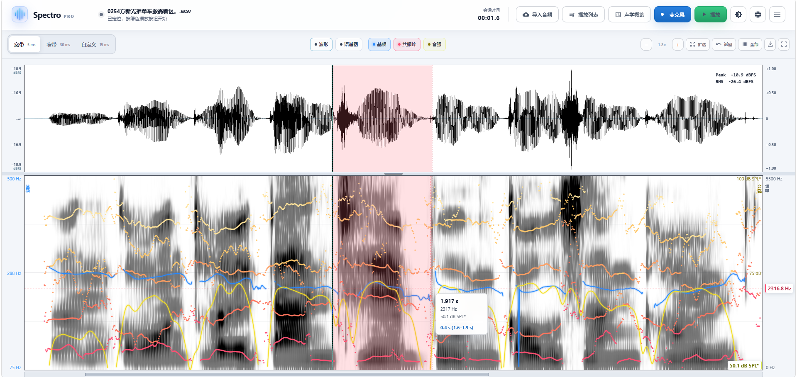

# Building Spectro Pro: From a Music Appreciation Class to a Working Tool

**English** | [简体中文](building-spectro-pro.zh-CN.md)

Related: [Building Spectro](making-of.md) · [Algorithms](algorithm.en.md) · [README](../README.en.md)

## It began with curiosity

I first encountered Spectro in a music appreciation class. While explaining the difference between musical tones and noise, my teacher opened the project and showed us how sound could become patterns of frequency on a screen. Something I had previously only heard suddenly had a visible shape.

The project immediately connected with my own interests. As an undergraduate, I had worked with a teacher on speech and acoustics research, so spectrograms, fundamental frequency, and formants were already familiar to me. Seeing Spectro made me wonder: what if it could display those speech parameters in real time, rather than showing only the spectrum?

_The original Spectro already combined Web Audio, background FFT processing, and WebGL rendering into a responsive real-time spectrogram._

## From visualizing sound to exploring speech

I forked Spectro and started experimenting. I did not begin with a complete feature list, nor did I set out to replace a professional speech-analysis tool. I simply followed that first question. Could the interface show a waveform beside the spectrogram? Could it track F0? Could it calculate formants and intensity live in the browser?

The original architecture gave me a strong starting point: Web Audio captured the signal, a Worker calculated the FFT, and WebGL drew each new spectral column. But the work soon grew beyond adding a few curves.

I had to reconsider the entire analysis path. How long should each window be? How should broadband and narrowband views trade time resolution for frequency resolution? Would the algorithms remain stable across sample rates? Would audio files and microphone input produce consistent results? Could the program avoid calculating layers that were not visible?

Some of the most important problems were almost invisible in the interface. Browser microphone samples have no universal physical calibration, so the limits of dB SPL readings needed to be stated clearly. Live formant analysis requires a centered window, which introduces a short delay. An F0 detector must cope with missing fundamentals, high-frequency interference, silence, and signals far messier than a clean sine wave.

As the project grew, I became convinced that its algorithms and limitations should be documented openly. Numbers should not look authoritative without explaining where they come from and where they can fail.

## Praat as a reference, not a target to replace

Anyone working with speech and acoustic analysis soon encounters Praat. Its documentation of spectrogram windows, pitch, Burg LPC formants, and intensity gave me a solid basis for checking the implementation. Some Spectro Pro parameters and formulas follow the Praat manual, and the tests use deterministic reference frames generated by Praat 6.6.30 to verify formant results.

_Waveform, spectrogram, and speech transcription in Praat. Image by Wugapodes, from [Wikimedia Commons](https://commons.wikimedia.org/wiki/File:Waveform_spectrogram_and_transcription_of_wikipedia_in_praat.png); see the source page for component licenses._

I still do not intend a browser tool to replace Praat, and I do not recommend using Spectro Pro directly for publications, clinical work, or other professional measurements. Professional tools are dependable not only because of their algorithms, but also because they support mature workflows, reproducible settings, equipment calibration, and years of validation.

Spectro Pro serves a different purpose: making acoustic information easy to see whenever it is useful.

In a classroom, it can demonstrate the difference between broadband and narrowband spectrograms or show how F0 and formants change as someone speaks. Outside the classroom, it can provide a quick visual check for clipping or unusual background noise in a recording. None of this should require a complicated setup. A modern browser is enough, and that accessibility is where I see the project's value.

## The result went further than I expected

<picture>
  <source media="(prefers-color-scheme: dark)" srcset="screenshot-dark.png">
  <source media="(prefers-color-scheme: light)" srcset="screenshot-light.png">
  
</picture>

_Spectro Pro today: an aligned waveform and spectrogram with F0, formants, intensity, and interactive readings._

I am genuinely pleased with how the project turned out. It still has clear boundaries, but synthetic-signal tests and Praat reference frames suggest that its results are remarkably reliable for its intended use. I still would not recommend it for professional measurement, but the finished tool went further than I expected.

More importantly, a passing thought—“it would be nice to see speech parameters live”—has become something people can use, understand, and continue to improve.

The experience also reminded me what makes open source so compelling. A WebGL spectrogram written by one person years ago was later opened by a teacher in another classroom, where it sparked an idea in a student interested in speech and acoustics. My changes now remain open under the MIT License as well.

If you see room to improve the algorithms, interaction, or documentation, your feedback is welcome. You are also free to fork the project, as I did, and adapt it to your own needs.

**Stay curious. Keep building. Let ideas gradually become things you have made.**
